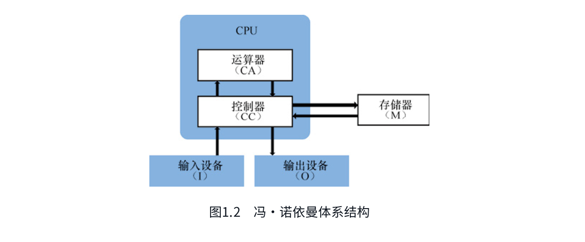
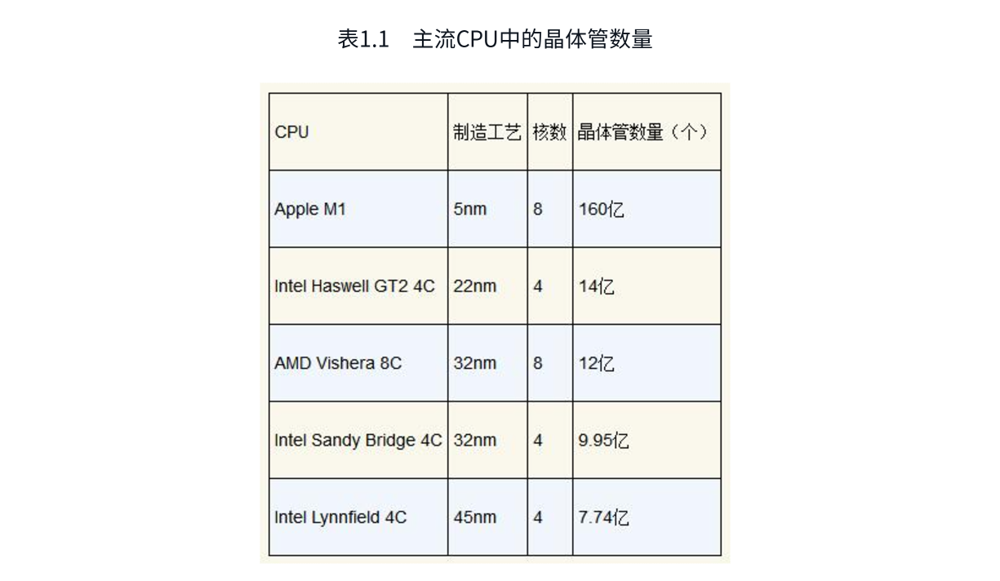
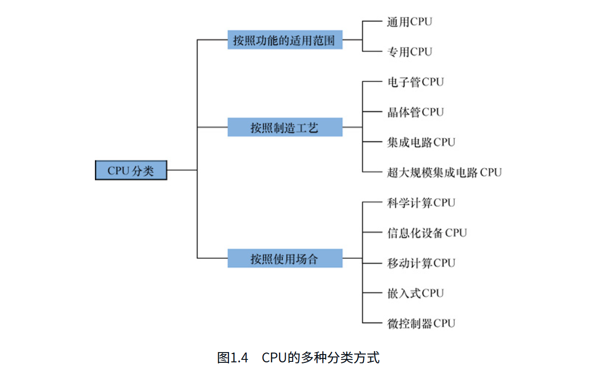

# CPU通识课

## CPU概览篇-时代与机遇

## 第1节 CPU时代
- 冯.诺依曼体系结构如下图所示:

- 抽象地讲，计算机的主要工作原理如下:
    1. 5个部分之间由通信线路进行连接。
    2. 要运行的任务（程序）保存在存储器（M）中。程序以连续排列的指令为单位组成，每条指令包含了一项计算操作。
    3. 计算机启动后，控制器（CC）从存储器中依次读取指令，将指令包含的信息传送到运算器（CA）中，由运算器解析指令的功能、执行数值运算。
    4. 指令执行时，有可能需要从外界读取要加工的数据；控制器向输入设备（I）发出消息，由输入设备把数据传送到计算机的内部。
    5. 指令执行结束后，控制器可以把运算器的计算结果存入存储器；控制器也可以向输出设备（O）发出消息，由输出设备把计算结果传送到计算机的外部。
    6. 控制器再从存储器中读取下一条指令并送入运算器。
    7. 上述“取指令—执行指令—保存结果”的过程多次重复执行，直到程序的最后一条指令执行完成。这样整个程序就运行结束了，计算机的使用者得到了期望的计算结果。
- CPU=运算器+控制器：在实际的计算机中，运算器、控制器两部分经常被一起设计，二者合称为中央处理器（Central Processing Unit，CPU）​。CPU的主要任务就是由控制器指挥计算机中的其他部件一起协同工作，并且由运算器执行数值计算。
- CPU在计算机中的地位：CPU指挥计算机中的其他部件工作。CPU是程序的调用者和运行者，程序的每一条指令都要经过CPU的解析和执行。外界向计算机输入数据，需要CPU进行接收；程序运行结束后，需要CPU发出指示才能把计算结果输出给外界。
- 主流CPU中的晶体管数量见表1.1。

- CPU影响国家经济发展和信息安全：从经济角度看，每年从国外进口的CPU数量巨大，信息产业的高额利润大部分被国外厂商赚取；从知识产权角度看，进口CPU的知识产权被国外把控，高端技术难以引进；从信息安全角度看，国外产品往往不提供设计资料和源代码，使用过程中经常出现后门和漏洞，国家的重要信息数据有被窃取和泄露的巨大风险。CPU在计算机、通信设备、工业控制设备中使用广泛，CPU的缺少会导致企业的产品生产和经营活动受到严重影响。
- CPU分类：CPU可以按照不同的方式进行分类，如图1.4所示：

    - 专用CPU面向某一应用领域专门设计，往往采用特殊结构来最大化发挥其在该领域的优势，也可以牺牲掉不必要的功能。专用CPU运行的操作系统也往往是根据需求定制的。例如在汽车上，面向整车状态监测而专门设计一个CPU，只用于监测特定的物理量，软件固化烧写在CPU内部的存储模块中。在可穿戴设备中，针对节省电能的要求设计的结构简单、低主频、低功耗的CPU。在智能门锁中，为了支持按键、刷卡、蓝牙等多种开锁方式而专门设计的低功耗CPU。
    - 超大规模集成电路CPU是第四代，一般是指所包含的晶体管数量庞大（例如超过100万个）的芯片。龙芯CPU也属于这一代。
    - 微控制器CPU则比嵌入式CPU更为低端，虽然体积小，但是用量巨大。现在只要是带有智能控制功能的电子设备都会包含微控制器，甚至我们每个人身上都可能携带了好几个微控制器。未来一旦真的实现“万物互联”​，微控制器将无处不在。