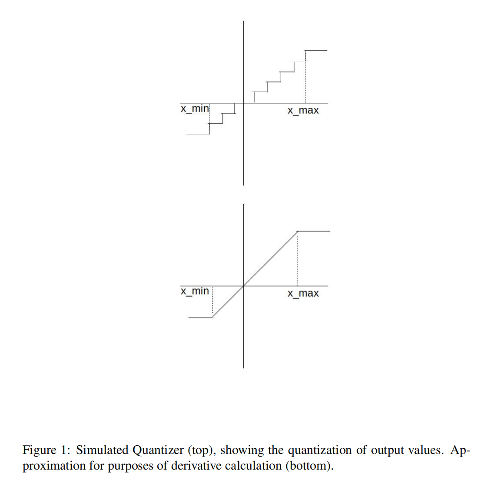

# 谷歌神经网络量化白皮书

## 简介

- 迫切需要一些技术来优化模型，以减少模型规模、更快的推理和降低功耗
  - 设计轻量级模型
  - 通过量化、剪枝和压缩技术减少模型的大小
- 降低任何模型复杂性的一个更简单的方法是降低权重和激活的精度要求（**模型量化**）。这种方法有许多优点：
  - 它广泛适用于一系列的模型和用例。人们不需要开发一个新的模型架构来提高速度。在许多情况下，我们可以从现有的浮点模型开始，快速量化，得到一个几乎没有精度损失的不动点量化模型，而不需要重新训练模型。多个硬件平台和库支持具有量化权重和激活功能的快速推断，因此不需要等待新的硬件开发。
  - 更小的模型占用空间：使用8位量化，人们可以将模型尺寸减少4倍，而精度损失可以忽略不计。这可以在不需要任何数据的情况下完成，因为只有权重是量化的。这也导致了模型更新的下载时间的加快。
  - 用于激活的工作内存和缓存减少：中间计算通常存储在缓存中，以便被深度网络的后期层重用，降低存储数据的精度会导致所需的工作内存减少。具有较低的精度权重和激活功能，允许更好的缓存重用。
  - 更快的计算速度：大多数处理器允许更快地处理8位数据。
  - 低功率：移动8位数据比移动32位浮点数据的效率高4倍。在许多深度体系结构中，内存访问可以主导功耗。因此，减少数据移动量可以对功耗产生显著影响。
以上所有因素都可以转化为更快的推理，由于内存访问和计算的精度降低，典型的加速速度为2-3倍。通过为低精度矢量算法优化的处理器和硬件加速器，可以进一步提高速度和功耗。

## 量化器设计

### 均匀仿射量化

- 考虑一个具有范围$(x_{min},x_{max})$的浮点变量，它需要被量化到范围$(0,N_{levels}-1)$，其中$N_{levels}=256$为8-bit精度。我们推导出了两个参数：Scale（∆）和零点(z)，它们将浮点值映射到整数。比例指定量化器的步长，浮点零点映射到零点。零点是一个整数，确保零被量化而没有误差。这对于确保像零填充这样的常见操作不会导致量化错误很重要的。
- 因此，对于单侧分布，范围$(x_{min},x_{max})$被放宽为包括零。例如，具有范围（2.1，3.5）的浮点变量将被放宽为（0，3.5），然后再量化。请注意，在极端单边分布的情况下，这可能会导致精度的损失。
- 一旦定义了尺度和零点，量化就会进行如公式1和公式2的操作：

$$
\begin{aligned}
x_{i n t} & =\operatorname{round}\left(\frac{x}{\Delta}\right)+z \\
x_Q & =\operatorname{clamp}\left(0, N_{\text {levels }}-1, x_{i n t}\right)
\end{aligned}
$$
其中
$$
\begin{array}{rlr}
\operatorname{clamp}(a, b, x) & =a & x \leq a \\
& =x & a \leq x \leq b \\
& =b & x \geq b
\end{array}
$$
而反量化的操作是公式3：
$$
x_{\text {float }}=\left(x_Q-z\right) \Delta
$$

- 虽然均匀仿射量化器允许以8位的精度存储权重和激活，但由于零点，会有额外的成本。考虑一个权重和一个激活之间的二维卷积，如公式4和公式5&6：

$$
\begin{aligned}
y(k, l, n) & =\Delta_w \Delta_x \operatorname{conv}\left(w_Q(k, l, m ; n)-z_w, x_Q(k, l, m)-z_x\right) \\
y(k, l, n) & =\operatorname{conv}\left(w_Q(k, l, m ; n), x_Q(k, l, m)\right)-z_w \sum_{k=0}^{K-1} \sum_{l=0}^{K-1} \sum_{m=0}^{N-1} x_Q(k, l, m) \\
& -z_x \sum_{k=0}^{K-1} \sum_{l=0}^{K-1} \sum_{m=0}^{N-1} w_Q(k, l, m ; n)+z_x z_w
\end{aligned}
$$

- 一个简单的卷积实现，通过在卷积之前执行零点的添加，由于更宽的（16/32位）操作数，导致吞吐量减少了2倍到4倍。使用上面的方程，注意最后一项是一个常数，其他每一项都需要N倍，这比8位点积多3倍。通过注意到在推理时权重是恒定的，并注意到所有相同大小的卷积核的激活的总和是相同的，可以进一步改进这一点。然而，这需要优化卷积内核。

### 均匀对称量化

- 仿射量化器的一个简化版本是对称量化器，它将零点限制为0。使用对称量化器，转换操作简化为，如公式7、公式8和公式9：

$$
\begin{aligned}
x_{\text {int }} & =\operatorname{round}\left(\frac{x}{\Delta}\right) \\
x_Q & =\operatorname{clamp}\left(-N_{\text {levels }} / 2, N_{\text {levels }} / 2-1, x_{\text {int }}\right) \quad \text { if signed } \\
x_Q & =\operatorname{clamp}\left(0, N_{\text {levels }}-1, x_{\text {int }}\right)
\end{aligned} \quad \text { if un-signed }
$$

- 为了更快地实现SIMD，我们进一步限制了权重的范围。在这种情况下，夹紧装置将被修改为公式10和公式11：

$$
\begin{array}{lr}
x_Q=\operatorname{clamp}\left(-\left(N_{\text {levels }} / 2-1\right), N_{\text {levels }} / 2-1, x_{\text {int }}\right) & \text { if signed } \\
x_Q=\operatorname{clamp}\left(0, N_{\text {levels }}-2, x_{\text {int }}\right) & \text { if un-signed }
\end{array}
$$

### 随机量化

- 随机量化将量化器建模为一个附加噪声，然后是四舍五入。随机量化器由：

$$
\begin{aligned}
x_{\text {int }} & =\operatorname{round}\left(\frac{x+\epsilon}{\Delta}\right)+z, \quad \epsilon \sim \operatorname{Unif}\left(-\frac{1}{2}, \frac{1}{2}\right) \\
x_Q & =\operatorname{clamp}\left(0, N_{\text {levels }}-1, x_{\text {int }}\right)
\end{aligned}
$$

- 反量化操作由[公式3](#公式3)给出。注意，在期望中，随机量化器减少为浮点权值的传递，在范围之外的值的饱和。因此，这个函数在计算梯度时表现得很好。我们不考虑随机量化的推理，因为大多数推理硬件不支持它。

### 反向传播中的模拟量化建模

- 对于量化感知训练，我们使用模拟量化操作来建模量化的效果，该模拟量化操作包括一个量化器和一个去量化器，即公式12和公式13，

$$
\begin{aligned}
x_{\text {out }} & =\operatorname{SimQuant}(x) \\
& =\Delta \operatorname{clamp}\left(0, N_{\text {levels }}-1, \operatorname{round}\left(\frac{x}{\Delta}\right)-z\right)
\end{aligned}
$$

- 由于模拟的均匀量化器函数的导数几乎在任何地方都是零，因此需要近似来模拟反向传递中的量化器。在实践中工作良好的近似是对公式14中指定的量化器进行建模，以定义其导数（见图1）。

$$
x_{\text {out }}=\operatorname{clamp}\left(x_{\min }, x_{\max }, x\right)
$$

- 向后传递被建模为一个“直通式估计器”。特别的，

$$
\delta_{\text {out }}=\delta_{\text {in }} I_{x \in S} S: x: x_{\min } \leq x \leq x_{\text {max }}
$$

其中$\delta_{i n}=\frac{\partial L}{\partial w_{o u t}}$是损失相对于模拟量化器输出的反向传播误差。

### 确定量化参数

- 量化器的参数可以用几个标准来确定。例如，TensorRT最小化了原始分布和量化分布之间的KL散度，以确定步长。在这项工作中，我们采用了更简单的方法。对于权重，我们使用实际的最小值和最大值来确定量化器的参数。对于激活，我们使用跨批的最小值和最大值的移动平均值来确定量化器参数。对于训练后的量化方法，可以通过仔细选择量化器参数来提高量化模型的精度。

### 量化的粒度

- 我们可以为一个整个张量指定一个单一的量化器（由尺度和零点定义），称为每层量化。通过将量化器参数调整于张量内的每个核，可以提高精度。例如，权值张量是4维的，是一个三维卷积核的集合，每个核负责生成一个输出特征映射。每个通道的量化对于每个卷积核都有不同的尺度和偏移量。我们不考虑激活的每通道量化，因为这将使conv和matmul操作的核心的内积计算复杂化。每层和过通道量化都允许有效的点积和卷积实现，因为在这两种情况下量化器参数都是固定的。