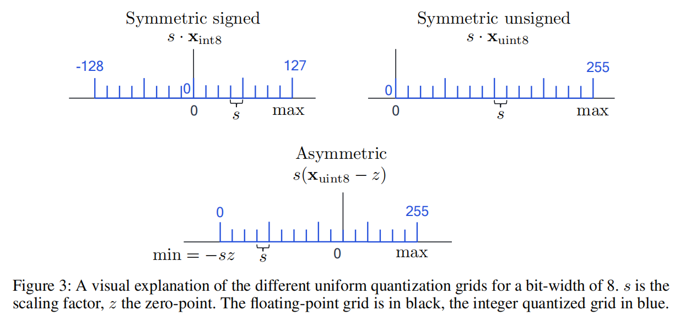

# 高通神经网络量化白皮书

- 神经网络量化会将权重和激活值张量以低bit存储。当从32bit存储变成8bit存储时，存储张量的内存开销变为原来的1/4，而矩阵乘法的计算开销变为原来的1/16。

## 硬件层面的背景

- 我们首先来考察下神经网络加速器里的矩阵乘以向量是怎么做的，如下图所示。为了提升推理的效率，这些硬件单元都是并行做计算。神经网络加速器的两个基本组件是处理单元$C_{n,m}$和加法器$A_n$。计算执行的顺序是：
  1. 把bias $\bold{b}_n$加载到加法器中；
  2. 把weight $\bold{W}_{n,m}$和输入的$\bold{x}_{m}$加载进数组，然后在一个时钟周期内在相应的处理单元$C_{n,m}=\bold{W}_{n,m}\bold{x}_{m}$计算它们的乘积。
  3. 结果在加法器中按照下式相加。
$$A_n=\bold{b}_n+\sum_{m}C_{n,m}$$
以上的操作就是一个**MAC**（*Multiply-Accumulate*）。对于大型矩阵向量乘法，这一步会重复很多次。

- 一旦所有的循环都完成了，累加器中的值就会被移回内存中，用于下一个神经网络层。
- 神经网络通常使用FP32的权值和激活值来进行训练。如果我们要在FP32中执行推理，处理元素和累加器将必须支持浮点逻辑，并且我们将需要将32位数据从内存传输到处理单元。
- **MAC操作和数据传输消耗了神经网络推理过程中所花费的大部分能量**。因此，通过对这些量使用较低的比特定点或量化表示，可以获得显著的好处。低位定点表示，如INT8，不仅减少了数据传输量，而且还减少了MAC操作的大小和能量消耗。乘法的成本通常与使用的bit位数呈二次关系，并且定点加法比浮点加法更高效。
- 通过量化权重和激活，我们可以写出累加的量化版本：

$$\begin{aligned}
\hat{A}_n & =\widehat{\mathbf{b}}_n+\sum_m \widehat{\mathbf{W}}_{n, m} \widehat{\mathbf{x}}_m \\
& =\widehat{\mathbf{b}}_n+\sum_m\left(s_{\mathbf{w}} \mathbf{W}_{n, m}^{\mathrm{int}}\right)\left(s_{\mathbf{x}} \mathbf{x}_m^{\mathrm{int}}\right) \\
& =\widehat{\mathbf{b}}_n+s_{\mathbf{w}} s_{\mathbf{x}} \sum_m \mathbf{W}_{n, m}^{\mathrm{int}} \mathbf{x}_m^{\mathrm{int}}
\end{aligned}$$

- 上式中有意忽略了偏置量化，因为偏置通常存储在更高的位宽（32位）中，其比例因子取决于权重和激活的比例因子。
- 下图显示了当我们引入量化时，神经网络加速器的变化。为了便于讨论，我们使用INT8举例，但是实际上这可以是任何量化形式。为累加器保持一个更高的位宽是很重要的，典型的是32位位宽。否则，由于在计算过程中计算了很多乘积的和，会有溢出的风险。存储在32位累加器中的激活需要先写入内存，然后才能被下一层使用。为了减少数据传输和下一层操作的复杂性，这些激活被**重量化**（requantization）回INT8，如下图所示。

## 均匀仿射量化（Uniform affine quantization）
- 均匀仿射量化，也称为非对称量化，由三个量化参数定义：尺度因子s、零点z和位宽b。比例因子和零点用于将浮点值映射到整数网格，网格的大小取决于位宽。比例因子通常用浮点数表示，并指定量化的步长。零点是一个整数，它确保实零被量化而没有误差。这对于确保zero padding或ReLU等通用操作不会引起量化错误很重要。
- 一旦定义了三个量化参数，我们就可以继续进行量化操作了。从一个实值向量$\bold{x}$开始，我们首先将它映射到无符号整数网格{0，……，$2^b$−1}，见公式4：
$$
\mathbf{x}_{\mathrm{int}}=\operatorname{clamp}\left(\left\lfloor\frac{\mathbf{x}}{s}\right\rceil+z ; 0,2^b-1\right)
$$
其中$\lfloor\cdot\rceil$是四舍五入操作而clamping定义如下：
$$
\operatorname{clamp}(x ; a, c)= \begin{cases}a, & x<a \\ x, & a \leq x \leq c \\ c, & x>c .\end{cases}
$$
- 为了得到近似实值输入x，我们采用了一个反量化步骤：
$$
\mathbf{x} \approx \widehat{\mathbf{x}}=s\left(\mathbf{x}_{\mathrm{int}}-z\right)
$$
- 结合上述两个步骤，我们可以给出量化函数的一般定义，$q(.)$：
$$
\widehat{\mathbf{x}}=q(\mathbf{x} ; s, z, b)=s\left[\operatorname{clamp}\left(\left\lfloor\frac{\mathbf{x}}{s}\right\rceil+z ; 0,2^b-1\right)-z\right]
$$
- 通过反量化步骤，我们还可以定义量化网格范围$(q_{min}, q_{max})$，其中$q_{min}=-sz$和$q_{max}=s(2^b-1-z)$。在此范围之外的任何$\bold{x}$值都将被截断到其限制，从而导致截断误差。如果我们想减少截断误差，我们可以通过增加尺度因子来扩大量化范围。然而，增加比例因子会导致舍入误差的增加，因为舍入误差位于范围$[-\frac{1}{2}s, \frac{1}{2}s]$.
- **原来$q_{min}, q_{max}$给出的是输入浮点数的范围呀，记住！**
### 对称均匀量化
- 对称量化是一般非对称情况的简化版本。对称量化将零点限制为0。这减少了在[公式3](#公式3)中的积累操作中处理零点偏移量的计算开销。但是偏移量的缺失限制了整数域和浮点域之间的映射。因此，选择有符号还是无符号的网格很重要。
$$
\widehat{\mathbf{x}}=s \mathbf{x}_{\mathrm{int}}
$$
- 对于无符号整数：
$$
\mathbf{x}_{\mathrm{int}}=\operatorname{clamp}\left(\left\lfloor\frac{\mathbf{x}}{s}\right\rfloor ; 0,2^b-1\right)
$$
- 对于有符号整数：
$$
\mathbf{x}_{\mathrm{int}}=\operatorname{clamp}\left(\left\lfloor\frac{\mathrm{x}}{s}\right\rceil ;-2^{b-1}, 2^{b-1}-1\right)
$$
- 无符号对称量化非常适合于单尾分布，如ReLU激活，如下图。而对于近似对称的分布，可以选择符号对称量化。

### 量化粒度
- 我们已经定义了每个张量的一组量化参数（量化器），一个用于权值，另一个用于激活，如[公式3](#公式3)所示。这叫做per-tensor量化。我们还可以为一个张量的每一段（例如，一个权值张量的输出通道）定义一个单独的量化器，从而增加量化粒度。在神经网络量化中，per-tensor量化是最常见的粒度选择，因为它的硬件实现更简单：[公式3](#公式3)中的所有加法器都使用相同的尺度因子，$\bold{s_ws_x}$。然而，我们可以使用更细的粒度来进一步提高性能。例如，对于权值张量，我们可以为每个输出通道指定一个不同的量化器。这被称为per-channel量化。
- 其他工作超越了每通道的量化参数，并对每组权重或激活应用单独的量化器。增加组的粒度通常会以牺牲一些额外的开销为代价来提高准确性。开销与累加器处理具有不同尺度因子的值的和有关。大多数现有的定点加速器目前都不支持这种逻辑，因此，我们将不会在这项工作中考虑它们。然而，随着这一领域研究的增长，未来有望对这些方法提供更多的硬件支持。
## 量化模拟
- 量化模拟：为了测试神经网络在量化设备上运行的效果，我们经常在我们用于训练神经网络的相同通用硬件上模拟量化行为。
- 在设备上的推断过程中，**对硬件的所有输入（偏差、权重和输入激活）都是以定点格式进行的**。当我们使用通用的深度学习框架和通用硬件来模拟量化时，**这些量都是以浮点形式表示的**。这就是为什么我们在计算图中引入量化器来引入量化效应的原因。图4b显示了如何在深度学习框架中建模相同的卷积层。在权值和卷积之间添加量化器块来模拟权值量化，在激活函数之后来模拟激活量化。偏置通常不被量化，因为它被存储在更高的精度中。量化器块实现了[公式7](#公式7)的量化函数，每个量化器由一组量化参数（比例因子、零点、位宽）定义。量化器的输入和输出都是浮点格式的，但输出都在量化网格上。

### 批标准化折叠
- 批处理标准化在缩放和添加偏移量之前对线性层的输出进行归一化，如下式所示：
$$
\operatorname{BatchNorm}(\mathbf{x})=\gamma\left(\frac{\mathbf{x}-\mu}{\sqrt{\sigma^2+\epsilon}}\right)+\beta
$$
其中$\mu$和$\sigma$是训练过程中计算的平均值和方差，作为批统计上的指数移动平均值，$\gamma$和$\beta$是每个通道的仿射超参数。
- 对于设备上的推断，这些操作被折叠成前一个或下一个线性层，这个步骤称为批标准化折叠。这将完全从网络中删除批标准化操作，因为计算被吸收到相邻的线性层中。除了减少额外的缩放和偏移量的计算开销外，这还可以防止额外的数据移动和层输出的量化。
- 如果在线性层$\bold{y}=BatchNorm(\bold{W}\bold{x})$之后立即应用批归一化，我们可以重写这些项，使批归一化操作与线性层本身融合。假设一个权重矩阵$\bold{W}\in\mathbb{R}^{n\times m}$，我们对每个输出$\bold{y}_k$（$k={1,...,n}$）应用批处理归一化：
$$
\begin{aligned}
\mathbf{y}_k & =\operatorname{BatchNorm}\left(\mathbf{W}_{k,:} \mathbf{x}\right) \\
& =\boldsymbol{\gamma}_k\left(\frac{\mathbf{W}_{k,:} \mathbf{x}-\boldsymbol{\mu}_k}{\sqrt{\mathbf{\sigma}_k^2+\epsilon}}\right)+\boldsymbol{\beta}_k \\
& =\frac{\boldsymbol{\gamma}_k \mathbf{W}_{k,:}}{\sqrt{\boldsymbol{\sigma}_k^2+\epsilon}} \mathbf{x}+\left(\boldsymbol{\beta}_k-\frac{\boldsymbol{\gamma}_k \boldsymbol{\mu}_k}{\sqrt{\boldsymbol{\sigma}_k^2+\epsilon}}\right) \\
& =\widetilde{\mathbf{W}}_{k,:} \mathbf{x}+\widetilde{\mathbf{b}}_k
\end{aligned}
$$
其中公式11和公式11：
$$
\begin{aligned}
\widetilde{\mathbf{W}}_{k,:} & =\frac{\boldsymbol{\gamma}_k \mathbf{W}_{k,:}}{\sqrt{\boldsymbol{\sigma}_k^2+\epsilon}} \\
\widetilde{\mathbf{b}}_k & =\boldsymbol{\beta}_k-\frac{\boldsymbol{\gamma}_k \boldsymbol{\mu}_k}{\sqrt{\boldsymbol{\sigma}_k^2+\epsilon}}
\end{aligned}
$$
### 激活函数融合
- 在第2.1节中介绍的朴素量化加速器中，我们看到激活的恢复发生在矩阵的乘法或卷积输出值计算之后。然而，在实践中，我们经常有一个非线性紧接着线性操作。将线性层的激活写入内存，然后将它们加载回计算核心以应用非线性，这将是一种浪费。因此，许多硬件解决方案都附带了一个在恢复步骤之前应用非线性的硬件单元。如果是这样，我们只需要模拟在非线性之后发生的补偿。例如，ReLU非线性很容易由请求化块建模，因为您可以只需将该激活量化的最小可表示值设置为0。
- 其他更复杂的激活功能，如sigmoid或Swish，需要更多的专门支持。如果这种支持不可用，我们需要在图中的非线性性前后添加一个量化步骤。这对量化模型的精度有很大的影响。尽管像Swish函数这样的新激活在浮点上提供了精度提高，但这些可能在量化后消失，或者在定点硬件上部署效率较低。
### 其他层的量化
- 在神经网络中还使用了许多其他类型的层。如何对这些数据进行建模在很大程度上取决于特定的硬件实现。有时，模拟量化和目标性能之间的不匹配是由于层没有被正确地量化。在这里，我们提供了一些指导，关于如何模拟一些常用的层的量化：
  - Max pooling：激活不需要量化，因为输入和输出值在同一个量化网格上。
  - Average pooling：整数的平均值并不一定是一个整数。因此，在平均池化之后，需要进行一个量化步骤。然而，我们使用相同的量化器的输入和输出，因为量化范围没有显著的变化。
  - Element-wise addition：尽管该操作的性质很简单，但它还是很难进行精确的模拟。在添加过程中，两个输入的量化范围必须精确匹配。如果这些范围不匹配，就需要注意得使加法按照预期工作。目前还没有单一公认的解决方案，但添加一个重量化步骤可以粗略地模拟添加的噪声。另一种方法是通过绑定输入的量化网格来优化网络，这样做的话就不需要重量化这一步了，但可能需要进行finetune。
  - Concatenation：被连接的两个分支通常不共享相同的量化参数。这意味着它们的量化网格可能不会重叠，因此需要进行一个恢复步骤。与元素级添加一样，您可以优化网络，以便为被连接的分支提供共享的量化参数。
## 最佳实践
- 齐次位宽（*homogeneous* bit-width）：权重或激活所选择的位宽在所有层中都保持不变。
### 对称量化vs非对称量化
- 对于每个权值和激活量化，我们必须选择一个量化方案。一方面，非对称量化更有表现力，因为有一个额外的偏移参数，但另一方面也有可能的计算开销。要知道为什么会这样，考虑一下当不对称的权重，$\widehat{\mathbf{W}}=s_{\mathbf{w}}\left(\mathbf{W}_{\mathrm{int}}-z_{\mathbf{w}}\right)$，乘以不对称的激活时$\widehat{\mathbf{x}}=s_{\mathbf{x}}\left(\mathbf{x}_{\mathrm{int}}-z_{\mathbf{x}}\right)$:
$$
\begin{aligned}
\widehat{\mathbf{W}} \widehat{\mathbf{x}} & =s_{\mathbf{w}}\left(\mathbf{W}_{\text {int }}-z_{\mathbf{w}}\right) s_{\mathbf{x}}\left(\mathbf{x}_{\text {int }}-z_{\mathbf{x}}\right) \\
& =s_{\mathbf{w}} s_{\mathbf{x}} \mathbf{W}_{\text {int }} \mathbf{x}_{\text {int }}-s_{\mathbf{w}} z_{\mathrm{w}} s_{\mathbf{x}} \mathbf{x}_{\mathrm{int}}-s_{\mathbf{w}} s_{\mathbf{x}} z_{\mathbf{x}} \mathbf{W}_{\mathrm{int}}+s_{\mathbf{w}} z_{\mathbf{w}} s_{\mathbf{x}} z_{\mathbf{x}}
\end{aligned}
$$
第一项是就算两个操作都是对称格式也会有的项。第三项和第四项仅取决于预先已知的量尺度，偏移量和权重值。因此，这两个项可以预先计算，并以几乎没有成本的方式添加到一个层的偏差项中。然而，第二项取决于输入数据x。这意味着，对于每一批数据，我们需要在推理期间计算一个额外的项。这可能会导致延迟和功率方面的大量开销，因为这相当于增加一个额外的通道。**因此，使用非对称激活量化和对称权重量化是一种常见的方法，从而避免了附加的数据依赖项。**
- 每个通道的权值量化可以提高精度，特别是当权值的分布在不同通道之间有显著差异时。回顾[公式3](#公式3)中量化的MAC操作，我们可以看到，每个通道中的权重量化可以通过应用一个单独的每通道权重尺度因子在加速器中实现，而不需要重新缩放。每个通道的激活量化很难实现，因为我们不能将比例因子从求和中考虑出来，因此，需要为每个输入通道重新缩放累加器。
# 量化感知训练
- 训练后量化有局限性，特别是当针对激活的低位量化时，如4位及以下。训练后的技术可能不足以减轻由低位量化引起的大的量化误差。在这些情况下，我们求助于量化感知训练（QAT）。QAT在训练过程中对量化噪声源进行建模（见第2.3节）。这使得模型能够找到比训练后的量化更多的最优解决方案。然而，更高的精度伴随着神经网络训练的通常成本，即更长的训练时间，需要标记数据和超参数搜索。
## 在反向传播的过程中模拟量化
- 为了训练量化的网络，我们需要通过模拟的量化器进行反向传播。这就提出了一个问题，因为[公式4](#公式4)中圆到最近的操作的梯度要么是零，要么是未定义的，这使得基于梯度的训练不可能。解决这个问题的一种方法是使用直接估计器（STE）来近似梯度，它将舍入算子的梯度近似为1：
$$
\frac{\partial\lfloor y\rceil}{\partial y}=1
$$
使用这个近似，我们现在可以从[公式7](#公式7)中计算出量化操作的梯度。为了清晰起见，我们假设对称量子化，即$z=0$，但同样的结果也适用于非对称量子化，因为零点是一个常数。我们使用n和p来定义整数网格极限，这样$n=q_{min}/s$和$p=q_{max}/s$。[公式7](#公式7)关于输入$\bold{x}_i$的梯度是：
$$
\begin{aligned}
\frac{\partial \widehat{\mathbf{x}}_i}{\partial \mathbf{x}_i} & =\frac{\partial q\left(\mathbf{x}_i\right)}{\partial \mathbf{x}_i} \\
& =s \cdot \frac{\partial}{\partial \mathbf{x}_i} \operatorname{clamp}\left(\left\lfloor\frac{\mathbf{x}_i}{s}\right\rceil ; n, p\right)+0 \\
& = \begin{cases}s \cdot \frac{\partial\left\lfloor\mathbf{x}_i / s\right\rceil}{\partial\left(\mathbf{x}_i / s\right)} \frac{\partial\left(\mathbf{x}_i / s\right)}{\partial \mathbf{x}_i} & \text { if } q_{\min } \leq \mathbf{x}_i \leq q_{\max }, \\
s \cdot \frac{\partial n}{\partial \mathbf{x}_i} & \text { if } \mathbf{x}_i<q_{\min }, \\
s \cdot \frac{\partial p}{\partial \mathbf{x}_i} & \text { if } \mathbf{x}_i>q_{\max },\end{cases} \\
& = \begin{cases}1 & \text { if } q_{\min } \leq \mathbf{x}_i \leq q_{\max }, \\
0 & \text { otherwise. }\end{cases}
\end{aligned}
$$
使用这个梯度定义，我们现在可以通过量化块进行反向传播。图10显示了在量化感知训练中使用的正向和向后传递的简单计算图。前向通路与[图4](#图4)相同，但在向后通路中，由于STE假设，我们有效地跳过了量化器块。在早期的QAT工作中，权重和激活的量化范围在每次迭代中最常用的更新方法是使用最小-最大范围。在后来的工作中，STE用于计算关于量化参数z和s的梯度。利用链式规则和STE，我们首先计算关于scale的梯度：

$$
\begin{aligned}
\frac{\partial \widehat{\mathbf{x}}_i}{\partial s} & =\frac{\partial}{\partial s}\left[s \cdot \operatorname{clamp}\left(\left\lfloor\frac{\mathbf{x}_i}{s}\right\rceil ; n, p\right)\right] \\
& = \begin{cases}-\mathbf{x}_i / s+\left\lfloor\mathbf{x}_i / s\right\rceil & \text { if } q_{\min } \leq \mathbf{x}_i \leq q_{\max } \\
n & \text { if } \mathbf{x}_i<q_{\min } \\
p & \text { if } \mathbf{x}_i>q_{\max }\end{cases}
\end{aligned}
$$
最初，我们将零点限制为一个整数。为了使零点可学习，我们将其转换为实数并应用舍入算子。修正后的量化函数定义为：
$$
\widehat{\mathbf{x}}=q(\mathbf{x} ; s, z)=s \cdot\left[\operatorname{clamp}\left(\left\lfloor\frac{\mathbf{x}}{s}\right\rceil+\lfloor z\rceil ; n, p\right)-\lfloor z\rceil\right]
$$
关于zero point $z$的梯度也是通过将STE操作作用到rounding算子上的：
$$
\frac{\partial \widehat{\mathbf{x}}_i}{\partial z}= \begin{cases}0 & q_{\min } \leq \mathbf{x}_i \leq q_{\max } \\ -s & \text { otherwise }\end{cases}
$$
## BN层折叠和QAT
- 我们引入了批处理归一化折叠，它将缩放和添加吸收到一个线性层中，以允许更有效的推断。在量化感知训练过程中，我们想要密切地模拟推理行为，这就是为什么我们必须在训练过程中考虑bn折叠。请注意，在一些QAT文献中，BN折叠效应被忽略了。虽然当我们使用per-channel量化时这没什么问题，但对于per-tensor量化，保持BN展开将导致以下两种情况之一：
  - BN层在推理过程中应用每个通道的重新缩放。在这种情况下，我们不妨首先使用每通道的量化。
  - 在部署过程中，我们将BN折叠到权值张量中，当我们训练网络以适应不同的量化噪声时，可能会导致潜在的显著精度下降。
- 在QAT中建模BN折叠的一个简单但有效的方法是静态地将BN尺度折叠，并将其偏移成线性层的权值和偏差，正如我们在[公式11](#公式11)和[公式12](#公式11)中所看到的那样。这对应于权值的重新参数化，并有效地从网络中完全去除批处理归一化操作。当从一个收敛的预训练模型开始时，静态折叠是非常有效的.
- 另一种方法既更新了QAT期间的运行统计数据，又使用校正应用bn折叠。这种方法更麻烦，计算成本也更高，因为它涉及到一个双向前传递：一个用于批处理统计量，另一个用于量化的线性操作。然而，根据我们的实验（见表7），静态折叠虽然简单，但其性能相当或更好。
- 我们提到，当硬件支持时，per-channel量化可以提高精度。静态折叠重参数化也适用于per-channel量化。然而，per-channel量化提供了额外的灵活性，因为它允许我们将批标准化缩放操作吸收到每个通道的比例因子中。让我们通过重新审视BN折叠方程来看看这是如何可能的，但这一次引入了每个通道的权值量化，如$\widehat{\mathbf{W}}_{k,:}=q\left(\mathbf{W}_{k,:} ; s_{\mathbf{w}, k}\right)=s_{\mathbf{w}, k} \mathbf{W}_{k,:}^{\mathrm{int}}$。通过对一个类似于[公式10](#公式10)的线性层的输出进行批处理归一化，我们得到：
$$
\begin{aligned}
\widehat{\mathbf{y}}_k & =\text { BatchNorm }\left(\widehat{\mathbf{W}}_{k,:} \mathbf{x}\right) \\
& =\frac{\boldsymbol{\gamma}_k \widehat{\mathbf{W}}_{k,:}}{\sqrt{\boldsymbol{\sigma}_k^2+\epsilon}} \mathbf{x}+\left(\boldsymbol{\beta}_k-\frac{\boldsymbol{\gamma}_k \boldsymbol{\mu}_k}{\sqrt{\mathbf{\sigma}_k^2+\epsilon}}\right) \\
& =\frac{\boldsymbol{\gamma}_k s_{\mathbf{w}, k}}{\sqrt{\boldsymbol{\sigma}_k^2+\epsilon}} \mathbf{W}_{k,:}^{\mathrm{int}} \mathbf{x}+\widetilde{\mathbf{b}}_k \\
& =\widetilde{s}_{\mathbf{w}, k}\left(\mathbf{W}_{k,:}^{\mathrm{int}} \mathbf{x}\right)+\widetilde{\mathbf{b}}_k
\end{aligned}
$$
我们可以看到，现在可以将批归一化缩放参数吸收到每个通道的比例因子中。对于QAT，这意味着我们可以在训练过程中保持BN层的完整，并在随后将BN层的缩放因子合并到每个通道的量化参数中。在实践中，从表7的最后两行中我们可以看到，与静态折叠相比，这种建模方法与per-channel量化相当或更好。
## QAT初始化
- **范围估计的影响**：为了评估初始范围设置对权重和激活的影响，我们进行了两组实验，总结在下表中。在第一个实验中，我们将权重量化为4bit，并保持激活在8bit。我们比较了最小-最大初始化和基于MSE的权重量化范围的初始化。虽然MSE初始化模型的起始精度明显更高，但在训练了20个epoch后，差距逐渐缩小。
为了探索激活量化的同样效果，我们进行了一个类似的实验，现在我们将激活量化到4bit，并将最小-最大初始化与基于MSE的初始化进行比较。从权值范围初始化中得到的观察结果在这里也适用。在下图中，我们展示了这个实验的完整训练曲线。在最初的几个时代，使用MSE初始化有一个显著的优势，但在训练的后期阶段几乎消失了。综上所述，更好的初始化可以得到更好的QAT结果，但增益通常较小，且随着训练持续时间越长而消失。

- 我们比较了其他PTQ改进的效果，如CLE和偏差校正。对于ResNet18，我们没有看到最终QAT性能的显著差异，而对于MobileNetV2，我们观察到没有CLE就不能进行训练。这可能是由于每张量量化导致的灾难性性能下降。
## 标准QAT pipeline
- 我们在下图中说明了推荐的管道。这个管道在各种计算机视觉和自然语言处理模型和任务上产生了良好的QAT结果，并可以被视为实现低成本量化性能的首选工具。

  - **Cross-layer equalization**：与PTQ类似，我们首先将CLE应用于全精度模型。正如我们在表9中所看到的，这一步对于遭受权重分布不平衡的模型是必要的，比如MobileNet架构。对于其他网络或在过通道量化的情况下，这个步骤可以是可选的。
  - **Add quantizers**：接下来，我们选择我们的量化器，并在我们的网络中添加量化操作，如第2.3节所述。量化器的选择可能取决于特定的目标HW，对于常见的人工智能加速器，我们建议使用对称量化器的权重和非对称量化器的激活。如果支持HW/SW堆栈，那么使用每通道量化的权重是有利的。在这个阶段，我们还将注意我们对批标准化的模拟是正确的，如4.2节所讨论的。
  - **Range estimation**：在训练之前，我们必须初始化所有的量化参数。更好的初始化将有助于更快的训练，并可能提高最终的准确性，尽管通常改进很小（见表8）。一般来说，我们建议使用基于分层MSE的标准来设置所有的量化参数。在每个通道量化的具体情况下，使用最小-最大设置有时是有利的。
  - **Learnable Quantization Parameters**：我们建议使量化器参数可学习，如第4.1节所述。直接学习量化参数，而不是在每个时代更新它们，会导致更高的性能，特别是在处理低位量化时。然而，当使用可学习的量化器时，为任务设置优化器需要特别注意。当使用sgd型优化器时，量化参数的学习速率需要比其他网络参数要降低。如果我们使用具有自适应学习率的优化器，如Adam或RMSProp，就可以避免学习率的调整。
